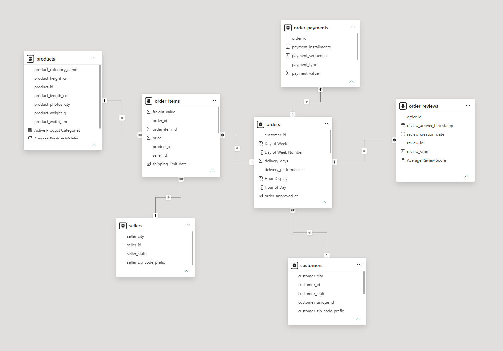
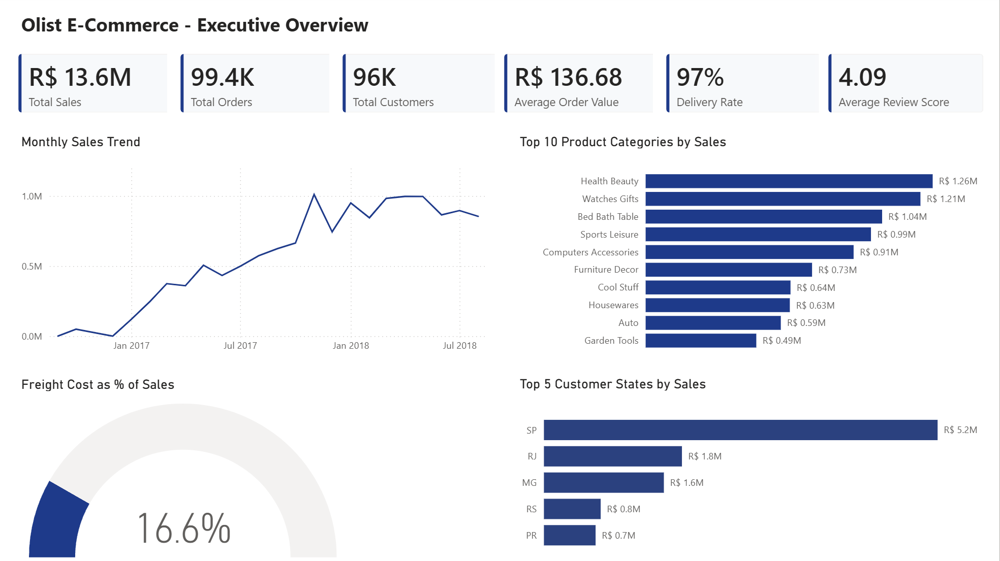
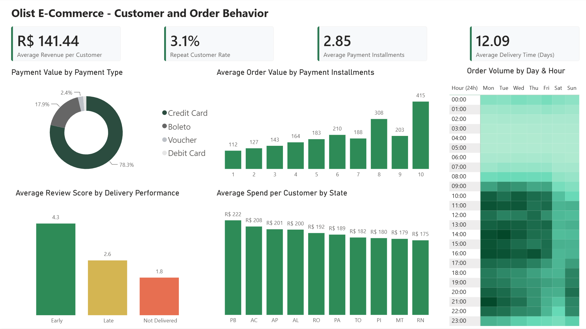
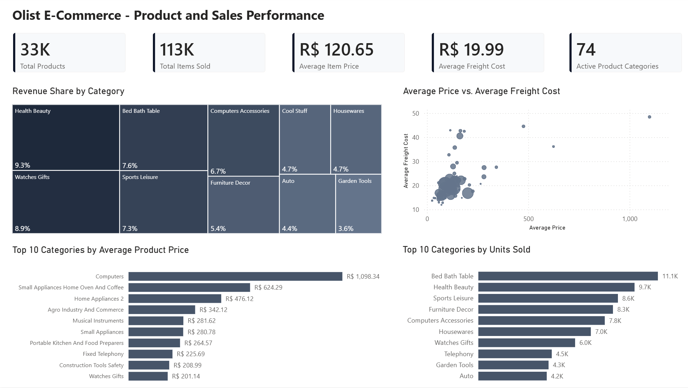

# Olist E-Commerce Analytics

## Business Problem

Olist is a Brazilian e-commerce marketplace connecting customers with thousands of sellers across the country. As the marketplace grows, the business needs to understand its sales performance, customer behavior, product and market performance, purchasing patterns, and delivery experience to identify what is driving business performance, uncover areas of opportunity, and support data-driven decisions for growth, customer retention, and improved customer experience.

## Objective

Analyze historical e-commerce transaction data to understand the key drivers of sales, customer behavior, product performance, and operational performance, and use these insights to identify opportunities for business growth and improved customer experience.

## Business Questions

1. How is the overall business performing, and how has sales performance evolved over time?
2. What is the value and purchasing behavior of the customer base, and how strong is customer retention?
3. Which product categories are driving revenue and order volume?
4. Which geographic markets contribute the most to sales?
5. How do customers prefer to pay, and when are they most likely to place orders?
6. How does delivery performance influence customer satisfaction?

## Dataset Overview

The analysis uses the Brazilian E-Commerce Public Dataset by Olist, which contains anonymized commercial data from orders placed on the Olist marketplace in Brazil.

The dataset covers approximately 100K orders placed between September 2016 and October 2018 and provides information across orders, customers, products, sellers, payments, reviews, and order items.

The dataset was obtained from [Kaggle](https://www.kaggle.com/datasets/olistbr/brazilian-ecommerce).

### Tables Used

| Table | Description |
|---|---|
| orders | Order status, purchase dates, delivery dates, and estimated delivery dates |
| customers | Customer identifiers and geographic information |
| order_items | Products purchased, item prices, and freight values |
| products | Product information and product categories |
| order_payments | Payment methods, installments, and payment values |
| order_reviews | Customer review scores and review information |
| sellers | Seller identifiers and geographic information |

### Important Fields

| Table | Field | Description |
|---|---|---|
| orders | order_id | Unique identifier for each order |
| orders | order_purchase_timestamp | Date and time the order was placed |
| orders | order_delivered_customer_date | Date the order was delivered |
| orders | order_estimated_delivery_date | Estimated delivery date |
| customers | customer_unique_id | Unique customer identifier |
| customers | customer_state | Customer's state |
| order_items | product_id | Product identifier |
| order_items | price | Price of the order item |
| order_items | freight_value | Freight cost for the order item |
| products | product_category_name | Product category |
| order_payments | payment_type | Payment method |
| order_payments | payment_installments | Number of payment installments |
| order_payments | payment_value | Payment value |
| order_reviews | review_score | Customer review score |

## Data Preparation

* **Data cleaning:** Reviewed the datasets for missing values, duplicates, and inconsistent records.
* **Data type conversion:** Converted date/time fields to appropriate DateTime formats and ensured numerical fields used the correct data types.
* **Missing value handling:** Assessed missing values and retained or excluded records based on their relevance to the analysis.
* **Feature engineering:** Created analytical fields such as delivery days, delivery performance, and other measures required for customer, sales, and operational analysis.
* **Translated product categories:** Merged the Portuguese product-category translation table with the products table and created an English category field.
* **Handled untranslated categories:** Added English labels for the three categories not present in the translation table and assigned blank categories to Uncategorized.
* **Removed unnecessary fields:** Removed product name/description length fields and review text fields that were not relevant to the analytical objectives.
* **Optimized the model:** Disabled loading for the product-category translation and geolocation queries to keep the final Power BI model focused and streamlined.

## Data Model

The Power BI data model was designed around the `orders` table, with related tables providing customer, product, payment, review, and seller information.



The main relationships used in the model include:

- `customers` → `orders`
- `orders` → `order_items`
- `products` → `order_items`
- `orders` → `order_payments`
- `orders` → `order_reviews`
- `sellers` → `order_items`

The model uses these relationships to connect transactional, customer, product, payment, review, and seller data while supporting the dashboard's sales, customer behavior, product performance, and delivery analyses.

## Key DAX Measures

The dashboard uses DAX measures to calculate core business KPIs, customer metrics, delivery performance, payment behavior, and product-level metrics.

#### Sales & Business Performance
```dax
Total Sales = 
SUM(order_items[price])

Total Orders = 
DISTINCTCOUNT(orders[order_id])

Average Order Value = 
DIVIDE([Total Sales], [Total Orders])

```

#### Customer Behavior
```dax
Orders per Customer = 
DIVIDE([Total Orders], [Total Customers])

Average Revenue per Customer = 
DIVIDE([Total Sales], [Total Customers])

Repeat Customer Rate = 
VAR CustomerOrderCounts =
    ADDCOLUMNS(
        VALUES(customers[customer_unique_id]),
        "OrderCount",
        CALCULATE(DISTINCTCOUNT(orders[order_id]))
    )
VAR RepeatCustomers =
    COUNTROWS(
        FILTER(CustomerOrderCounts, [OrderCount] > 1)
    )
RETURN
    DIVIDE(RepeatCustomers, [Total Customers])
```

#### Delivery & Customer Experience

```dax
Average Delivery Days = 
AVERAGE(orders[delivery_days])

Delivered Orders = 
CALCULATE(
    [Total Orders],
    orders[order_status] = "delivered"
)

Delivery Rate = 
DIVIDE([Delivered Orders], [Total Orders])

Average Review Score = 
AVERAGE(order_reviews[review_score])
```

#### Product & Logistics

```dax
Total Items Sold = 
COUNTROWS(order_items)

Average Item Price = 
AVERAGE(order_items[price])

% Share of Sales = 
DIVIDE(
    SUM(order_items[price]),
    CALCULATE(
        SUM(order_items[price]),
        ALL(products[product_category_name])
    )
)
```

## Dashboard

The Power BI dashboard is organized into three pages, each focused on a different aspect of business performance and designed to answer the defined business questions.

### Page 1 - Executive Overview

Provides a high-level view of overall business performance, including sales, orders, customers, average order value, sales trends, geographic performance, and revenue distribution across product categories.



### Page 2 - Customer and Order Behavior

Focuses on customer value, purchasing frequency, retention, payment behavior, order timing, and the relationship between delivery performance and customer satisfaction.



### Page 3 - Product and Sales Performance

Examines product demand, category-level sales, item pricing, freight costs, product characteristics, and other product-level performance indicators.




## Executive Findings

### 1. Overall Business Performance and Growth

- **Performance Overview:** The business generated **R$ 13.6M** in sales across **99.4K orders**, maintaining an Average Order Value (AOV) of **R$ 136.68**. Operational performance remains strong, supported by a **97% delivery rate** and a **4.09/5 average review score**.
- **Growth Trajectory:** Sales grew substantially over the analyzed period, rising from modest levels at the start of **2017** to significantly higher monthly totals by **mid-2018**. The strongest momentum occurred through **2017 and early 2018**.

### 2. Customer Value and Retention Gap

- **Monetary Value vs. Frequency:** Each customer generates **R$ 141.44** in revenue on average, but most place only a single order. While the platform has successfully built a large buyer base of **96K unique customers**, order frequency remains low.
- **Repeat Rates:** With a **3.1% repeat customer rate**, the vast majority of buyers are one-time shoppers.

### 3. Product Demand and Revenue Distribution

- **Top Revenue Drivers:** **Health & Beauty** leads total revenue at **R$ 1.26M**, followed by **Watches & Gifts** (**R$ 1.21M**), **Bed Bath Table** (**R$ 1.04M**), **Sports Leisure** (**R$ 0.99M**), and **Computers Accessories** (**R$ 0.91M**). These core categories represent the platform's largest revenue contributors.
- **Order Volumes:** **Bed Bath Table** records the highest order-item volume at **11.1K**, followed by **Health Beauty** (**9.7K**) and **Sports Leisure** (**8.6K**). However, categories like **Computers** feature much higher average item prices, showing that overall sales value is driven by a mix of high-volume products and higher-priced products.

### 4. Primary Market and Checkout Behavior

- **Geographic Density:** **São Paulo (SP)** is the primary market, generating **R$ 5.2M** in sales, followed by major southeastern states such as Rio de Janeiro and Minas Gerais. This highlights a heavy geographical concentration in the Southeast region.
- **Payment Types and Peak Hours:** **Credit cards account for 78.3%** of payment value, making them the dominant checkout method, followed by **Boleto at 17.9%**. Customer order volume concentrates heavily between **10:00 AM and 10:00 PM**.

### 5. Delivery and Customer Reviews

- **Review Impact:** Delivery performance directly shapes customer perception. Orders delivered early achieve an average rating of **4.3/5**, whereas late deliveries drop sharply to **2.6/5**, and undelivered orders fall to **1.8/5**.


## Business Recommendations

### 1. Strengthen Customer Retention

With only **3.1% of customers returning to make another purchase**, customer retention represents the clearest growth opportunity. Introduce targeted second-purchase campaigns, personalized product recommendations, and post-purchase offers to convert more one-time buyers into repeat customers.

### 2. Prioritize High-Performing Product Categories

Categories such as **Health & Beauty, Watches & Gifts, Bed Bath & Table, Sports & Leisure, and Computers & Accessories** are the largest revenue contributors. Prioritize inventory availability, merchandising visibility, and targeted promotions for these categories while identifying opportunities to grow lower-performing categories.

### 3. Improve Delivery Reliability

When orders show up late, customer ratings drop from a strong **4.3** to **2.6**. Working closely with delivery partners and sending clear tracking updates to buyers will help prevent late packages and keep review scores high.

### 4. Align Promotional Scheduling with Peak Buying Hours

Most customers buy between **10:00 AM and 10:00 PM** and prefer paying by credit card. Schedule promotional emails and digital ad spend during these specific hours to get the best return on marketing.


## Summary

This project demonstrates an end-to-end e-commerce analytics solution, transforming raw, multi-table transactional data into actionable business insights. Through data preparation and modeling in Power BI, DAX-based analysis, and interactive dashboard development, the analysis highlights key opportunities to strengthen customer retention, prioritize high-performing product categories, improve delivery reliability, and align marketing activity with customer purchasing behavior.
